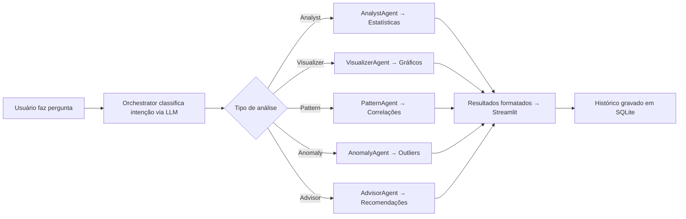

# 🧩 ARQUITETURA DA SOLUÇÃO – EDA BASEADA EM AGENTES INTELIGENTES

## 🧠 1. Visão Geral
A solução implementa uma **Análise Exploratória de Dados (EDA)** assistida por **agentes de IA especializados**, utilizando **LangChain**, **Gemini (Google GenAI)** e uma interface **Streamlit**.  
Cada agente é responsável por uma etapa distinta da exploração de dados, interagindo de forma orquestrada e armazenando o histórico de perguntas e respostas em **SQLite**.

---

## 🏗️ 2. Componentes Principais
| Componente | Função |
|-------------|--------|
| **`app_eda.py`** | Interface principal em Streamlit (upload, perguntas, visualização de resultados). |
| **`orchestrator.py`** | Define o orquestrador de agentes: interpreta a pergunta via LLM e encaminha para o agente correto. |
| **`analyst_agent.py`** | Gera estatísticas descritivas, tipos e valores ausentes. |
| **`visualizer_agent.py`** | Cria gráficos (histogramas, boxplots, barras, pizza) com interpretação automática via LLM. |
| **`pattern_agent.py`** | Identifica padrões e correlações (heatmaps, frequências, clusters simples). |
| **`anomaly_agent.py`** | Detecta outliers/anomalias via IQR, com explicação automática do LLM. |
| **`advisor_agent.py`** | Gera resumos, recomendações e conclusões gerais com base no histórico. |
| **`memory/`** | Módulo para armazenamento e recuperação de histórico de interações em SQLite. |
| **`.env` / `st.secrets`** | Armazenamento seguro de variáveis sensíveis (chaves Gemini, caminho da BD, idioma). |
| **`requirements.txt`** | Dependências do projeto. |

---

## 🔄 3. Fluxo de Execução

1. **Upload de Dados:** o utilizador carrega arquivos CSV/ZIP.
2. **Pergunta:** o utilizador faz perguntas em linguagem natural.
3. **Orquestração:** o Orchestrator usa LLM (Gemini) para identificar a intenção e chamar o agente certo.
4. **Execução:** o agente processa, interpreta (LLM) e devolve resultados (gráficos/textos).
5. **Renderização:** o Streamlit exibe o conteúdo de acordo com o tipo (`chart`, `table`, `text`, `json`).
6. **Histórico:** a interação é armazenada em SQLite e pode ser resumida pelo AdvisorAgent.

---

## 🧠 4. Inteligência por Agente
| Agente | Função | Saída | LLM | Fallback |
|:--------|:--------|:------|:-----|:-----------|
| **AnalystAgent** | Estatísticas descritivas | Texto + tabela | ✅ | ✅ |
| **VisualizerAgent** | Gráficos visuais | Charts + texto | ✅ | ✅ |
| **PatternAgent** | Correlações e padrões | Heatmap + texto | ✅ | ✅ |
| **AnomalyAgent** | Outliers (IQR) | Boxplots + texto | ✅ | ✅ |
| **AdvisorAgent** | Resumo e recomendações | Texto | ✅ | ✅ |
| **Orchestrator** | Roteamento semântico | JSON de resultados | ✅ | — |

---

## 💾 5. Persistência (SQLite)
Banco: `relatorios_nf.db`
```sql
CREATE TABLE historico (
    id INTEGER PRIMARY KEY AUTOINCREMENT,
    usuario TEXT,
    pergunta TEXT,
    resposta TEXT,
    data TEXT DEFAULT CURRENT_TIMESTAMP
);
```
Funções principais (`memory.py`):
- `save_qa(usuario, pergunta, resposta)`
- `get_history(usuario)`
- `get_history_filtered(usuario, start_date, end_date, limit)`

---

## 🌐 6. Configuração e Deploy
- Variáveis no `.env` (local) ou `st.secrets` (Streamlit Cloud):
```toml
GEMINI_API_KEY = "AIxxxx"
GEMINI_MODEL = "gemini-2.0-flash-exp"
SQLITE_DB = "relatorios_nf.db"
LANG = "pt"
```
- `requirements.txt`:
```txt
streamlit
pandas
plotly
langchain
langchain-google-genai
python-dotenv
openpyxl
```
- Deploy via [Streamlit Cloud](https://share.streamlit.io)

---

## 🧭 7. Interface (Streamlit)
Tabs principais:
1. 📂 **Processamento** – Upload e perguntas.
2. 📊 **Resumo Geral** – Estatísticas e gráficos automáticos.
3. 🗂 **Histórico** – Consultas diárias paginadas (10 itens por página).
4. ⚙️ **Configurações** – Ajustes e informações sobre a solução.

---

## 🧩 8. Diagrama de Fluxo


---

## 📘 9. Benefícios Técnicos
- Modular e extensível (fácil adicionar novos agentes).
- Interpretação semântica automatizada com Gemini.
- Persistência local via SQLite.
- Visualização interativa com Plotly.
- Fallback inteligente em todos os agentes.
- Deploy seguro com `st.secrets`.

---

## 🧭 10. Futuras Extensões
- **TrendAgent** – análise temporal.
- **ClusterAgent** – agrupamento automático (K-Means).
- **QualityAgent** – verificação de duplicidade e consistência.
- **Relatórios PDF automáticos**.
- **Dashboard interativo consolidado**.

---

## 🏁 Conclusão
A arquitetura da solução EDA baseada em agentes é **robusta, modular e inteligente**, combinando interpretação semântica (LLM), análise quantitativa (Pandas/Plotly) e persistência estruturada (SQLite).  
Permite exploração de dados por linguagem natural, visualizações dinâmicas e recomendações automáticas.
